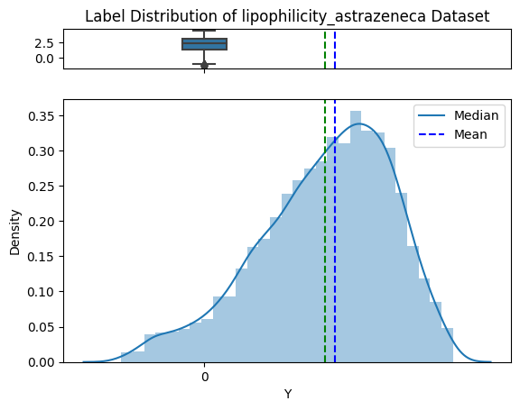
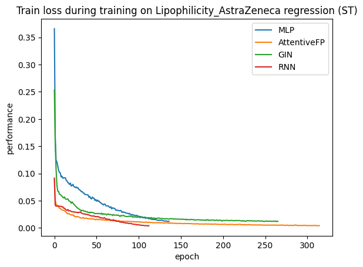
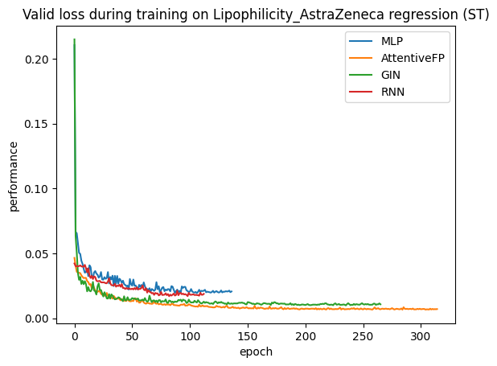
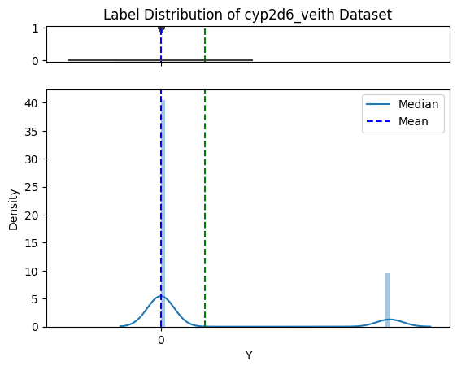
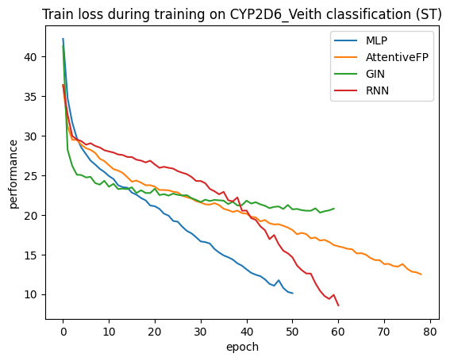
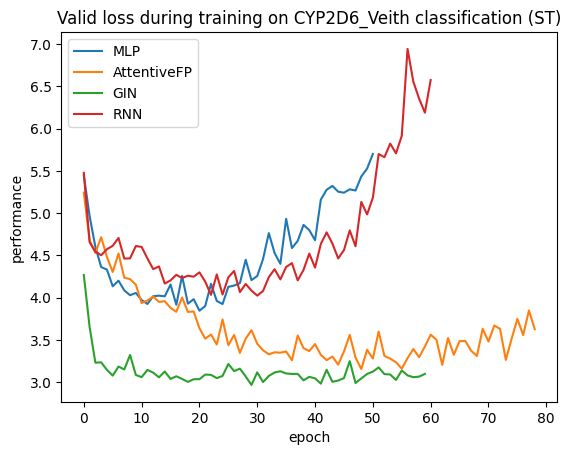

## Update on functions

### 10.31.2023
* Update scale function again
* Update uncertainty weight function inside train.py, [code](ADMET_10_31_uncertainty_weight.ipynb)
* https://colab.research.google.com/drive/1PC8NKSOR3XpuWalxz0gwI6N6S95IJaR2#scrollTo=7mMn2Ig84oe8&uniqifier=1

### 10.30.2023
* Update scale function in preprocess_mols.py, could specify which task to scale 
* Update function eval_perf_list, could specify which metrics to print out instead of using all metrics,
* need to check whether scaling on certain regression tasks improves accuracy, [code](ADMET_10_30_ST_scale_cetain_metrics.ipynb) is below 
* https://colab.research.google.com/drive/1PC8NKSOR3XpuWalxz0gwI6N6S95IJaR2?authuser=1#scrollTo=OR8fVGc751qx
*     

### Ongoing work


* VAE implementation
* write introduction


## Loss drop during training, single task

https://colab.research.google.com/drive/1pYgrZ8beRZtljh3M9q6KpeId8itfGuRl#scrollTo=q4I-e9vbUbUJ&uniqifier=1

···
	
 	name = 'Lipophilicity_AstraZeneca'
	results_dict = {
	    'MLP':['scale', 6], 
	    'AttentiveFP': ['scale', 1],
	    'GIN': ['scale', 7],
	    'RNN': ['scale', 2]
	}
	
	valid_dict_list, train_dict_list = [], []
	for model_type in model_types:
	    l = results_dict[model_type]
	    f = f'{name}_{l[0]}/{model_type}_ST_{l[1]}.yml'
	    with open(f, 'r') as d: data = yaml.safe_load(d)
	    valid_dict_list.append(data['valid_dict'])
	    train_dict_list.append(data['train_dict'])
	assert len(valid_dict_list) == len(model_types)
	from scripts.func_utils import *
	plot_performance(valid_dict_list, model_types, title=f'Valid loss during training on {name} regression (ST)')
	plot_performance(train_dict_list, model_types, title=f'Train loss during training on {name} regression (ST)')

	from scripts.CONSTANT import *
	name = 'CYP2D6_Veith'
	folder_name = f'cls/{name}'
	valid_dict_list, train_dict_list = [], []
	
	for model_type in model_types:
	    print('*'*30, model_type, '*'*30)
	    perfs, t_l, v_l = [], [], []
	    for i in range(3):
	        f = f'{folder_name}/{model_type}_ST_{i}.yml'
	        with open(f, 'r') as d_: data = yaml.safe_load(d_)
	        p = data['performance']
	        t_l.append(data['train_dict'])
	        v_l.append(data['valid_dict'])
	        eval_perf_list(p, name, {})
	        perfs.append(p)
	    best_idx = eval_perf_list(perfs, name, d)
	    print('\n\n')
	    train_dict_list.append(t_l[best_idx])
	    valid_dict_list.append(v_l[best_idx])
	
	from scripts.func_utils import *
	plot_performance(valid_dict_list, model_types, title=f'Valid loss during training on {name} classification (ST)')
	plot_performance(train_dict_list, model_types, title=f'Train loss during training on {name} classification (ST)')

···


| task type | data distribution| train | valid
:-----:|:-------------------------:|:--------------------:|:--------------------:  
|regression example|  | |  |   
| classification example |  |    |    


| Lipophilicity_AstraZeneca	|  mae  |  mse  |  rmse  |  r2  
:-----:|:---:|:-----:|:----:|:----:  
MLP |0.652   |0.707   |0.841   |0.521   
AFP |0.353   |0.239   |0.489   |0.834   
GIN |0.489   |0.419   |0.647   |0.717   
RNN |0.614   |0.667   |0.817   |0.549   

CYP2D6_Veith |  acc  |  w_acc  |  prec  |  recall  |  sp  |  f1  |  auc  |  mcc  |  ap  
:-----:|:---:|:-----:|:----:|:----:|:-----:|:---:|:-----:|:----:|:----:    
MLP |0.857   |0.717   |0.653   |0.494   |0.940   |0.562   |0.836   |0.486   |0.634  
AFP |0.883   |0.746   |0.772   |0.527   |0.964   |0.626   |0.870   |0.574   |0.712   
GIN |0.892   |0.786   |0.758   |0.617   |0.955   |0.680   |0.907   |0.621   |0.764   
RNN |0.848   |0.672   |0.650   |0.391   |0.952   |0.488   |0.803   |0.423   |0.555   


## Scale affects regression? 

https://colab.research.google.com/drive/1pYgrZ8beRZtljh3M9q6KpeId8itfGuRl#scrollTo=3oGnffnu4Zkn&uniqifier=1

```
for name in names_reg:
    # print('name', name)
    print('#'*80);print('#'*80)
    for model_type in model_types:
        folder_names = [f'{name}_no_scale', f'{name}_scale']
        bests = []
        for folder_name in folder_names:
            ps = []
            print(folder_name, model_type)
            for i in range(10):
                try: 
                    yml_name = f'{folder_name}/{model_type}_ST_{i}.yml'
                    p = yml_report(yml_name, ver=False)
                    ps.append(p)
                except: 
                    print(f'cannot open {folder_name}/{model_type}_ST_{i}.yml')
                    break

            best_idx = eval_perf_list(ps, name, d)
            best_p = ps[best_idx]
            # eval_perf_list(best_p, name, {})
            bests.append(best_p)
        
        print('#'*60)
        print(f'{name} {model_type} no scale vs scale')
        for i in bests:
            eval_perf_list(i, name, {})
        print('#'*60)
        print()

```


```
############################################################
Caco2_Wang MLP no scale vs scale
******************** Caco2_Wang ******************** 
	|  mae  |  mse  |  rmse  |  r2  
single: &0.453   &0.372   &0.610   &0.414   
******************** Caco2_Wang ******************** 
	|  mae  |  mse  |  rmse  |  r2  
single: &0.385   &0.243   &0.493   &0.618   
############################################################

############################################################
Caco2_Wang AttentiveFP no scale vs scale
******************** Caco2_Wang ******************** 
	|  mae  |  mse  |  rmse  |  r2  
single: &0.318   &0.154   &0.392   &0.758   
******************** Caco2_Wang ******************** 
	|  mae  |  mse  |  rmse  |  r2  
single: &0.331   &0.163   &0.404   &0.743   
############################################################


############################################################
Caco2_Wang GIN no scale vs scale
******************** Caco2_Wang ******************** 
	|  mae  |  mse  |  rmse  |  r2  
single: &0.398   &0.259   &0.509   &0.593   
******************** Caco2_Wang ******************** 
	|  mae  |  mse  |  rmse  |  r2  
single: &0.384   &0.242   &0.492   &0.619   
############################################################

############################################################
Caco2_Wang RNN no scale vs scale
******************** Caco2_Wang ******************** 
	|  mae  |  mse  |  rmse  |  r2  
single: &0.483   &0.359   &0.599   &0.435   
******************** Caco2_Wang ******************** 
	|  mae  |  mse  |  rmse  |  r2  
single: &0.485   &0.385   &0.621   &0.393   
############################################################


############################################################
Lipophilicity_AstraZeneca MLP no scale vs scale
******************** Lipophilicity_AstraZeneca ******************** 
	|  mae  |  mse  |  rmse  |  r2  
single: &0.649   &0.706   &0.840   &0.522   
******************** Lipophilicity_AstraZeneca ******************** 
	|  mae  |  mse  |  rmse  |  r2  
single: &0.652   &0.707   &0.841   &0.521   
############################################################

############################################################
Lipophilicity_AstraZeneca AttentiveFP no scale vs scale
******************** Lipophilicity_AstraZeneca ******************** 
	|  mae  |  mse  |  rmse  |  r2  
single: &0.364   &0.238   &0.487   &0.835   
******************** Lipophilicity_AstraZeneca ******************** 
	|  mae  |  mse  |  rmse  |  r2  
single: &0.353   &0.239   &0.489   &0.834   
############################################################

############################################################
Lipophilicity_AstraZeneca GIN no scale vs scale
******************** Lipophilicity_AstraZeneca ******************** 
	|  mae  |  mse  |  rmse  |  r2  
single: &0.515   &0.452   &0.672   &0.694   
******************** Lipophilicity_AstraZeneca ******************** 
	|  mae  |  mse  |  rmse  |  r2  
single: &0.489   &0.419   &0.647   &0.717   
############################################################

############################################################
Lipophilicity_AstraZeneca RNN no scale vs scale
******************** Lipophilicity_AstraZeneca ******************** 
	|  mae  |  mse  |  rmse  |  r2  
single: &0.589   &0.620   &0.788   &0.580   
******************** Lipophilicity_AstraZeneca ******************** 
	|  mae  |  mse  |  rmse  |  r2  
single: &0.614   &0.667   &0.817   &0.549   
############################################################


############################################################
HydrationFreeEnergy_FreeSolv MLP no scale vs scale
******************** HydrationFreeEnergy_FreeSolv ******************** 
	|  mae  |  mse  |  rmse  |  r2  
single: &0.765   &1.387   &1.178   &0.915   
******************** HydrationFreeEnergy_FreeSolv ******************** 
	|  mae  |  mse  |  rmse  |  r2  
single: &1.376   &3.146   &1.774   &0.808   
############################################################

############################################################
HydrationFreeEnergy_FreeSolv AttentiveFP no scale vs scale
******************** HydrationFreeEnergy_FreeSolv ******************** 
	|  mae  |  mse  |  rmse  |  r2  
single: &0.608   &0.925   &0.962   &0.943   
******************** HydrationFreeEnergy_FreeSolv ******************** 
	|  mae  |  mse  |  rmse  |  r2  
single: &0.942   &1.847   &1.359   &0.843   
############################################################

############################################################
HydrationFreeEnergy_FreeSolv GIN no scale vs scale
******************** HydrationFreeEnergy_FreeSolv ******************** 
	|  mae  |  mse  |  rmse  |  r2  
single: &1.136   &2.523   &1.588   &0.846   
******************** HydrationFreeEnergy_FreeSolv ******************** 
	|  mae  |  mse  |  rmse  |  r2  
single: &1.274   &2.491   &1.578   &0.848   
############################################################

############################################################
HydrationFreeEnergy_FreeSolv RNN no scale vs scale
******************** HydrationFreeEnergy_FreeSolv ******************** 
	|  mae  |  mse  |  rmse  |  r2  
single: &1.036   &1.890   &1.375   &0.884   
******************** HydrationFreeEnergy_FreeSolv ******************** 
	|  mae  |  mse  |  rmse  |  r2  
single: &1.348   &2.815   &1.678   &0.828   
############################################################


############################################################
Solubility_AqSolDB MLP no scale vs scale
******************** Solubility_AqSolDB ******************** 
	|  mae  |  mse  |  rmse  |  r2  
single: &0.904   &1.537   &1.240   &0.717   
******************** Solubility_AqSolDB ******************** 
	|  mae  |  mse  |  rmse  |  r2  
single: &0.931   &1.567   &1.252   &0.711   
############################################################

############################################################
Solubility_AqSolDB AttentiveFP no scale vs scale
******************** Solubility_AqSolDB ******************** 
	|  mae  |  mse  |  rmse  |  r2  
single: &0.662   &0.973   &0.986   &0.821   
******************** Solubility_AqSolDB ******************** 
	|  mae  |  mse  |  rmse  |  r2  
single: &0.682   &0.994   &0.997   &0.817   
############################################################

############################################################
Solubility_AqSolDB GIN no scale vs scale
******************** Solubility_AqSolDB ******************** 
	|  mae  |  mse  |  rmse  |  r2  
single: &0.794   &1.286   &1.134   &0.763   
******************** Solubility_AqSolDB ******************** 
	|  mae  |  mse  |  rmse  |  r2  
single: &0.777   &1.238   &1.112   &0.772   
############################################################

############################################################
Solubility_AqSolDB RNN no scale vs scale
******************** Solubility_AqSolDB ******************** 
	|  mae  |  mse  |  rmse  |  r2  
single: &0.747   &1.192   &1.092   &0.780   
******************** Solubility_AqSolDB ******************** 
	|  mae  |  mse  |  rmse  |  r2  
single: &0.772   &1.187   &1.089   &0.781   
############################################################


############################################################
LD50_Zhu MLP no scale vs scale
******************** LD50_Zhu ******************** 
	|  mae  |  mse  |  rmse  |  r2  
single: &0.457   &0.382   &0.618   &0.573   
******************** LD50_Zhu ******************** 
	|  mae  |  mse  |  rmse  |  r2  
single: &0.456   &0.377   &0.614   &0.578   
############################################################

############################################################
LD50_Zhu AttentiveFP no scale vs scale
******************** LD50_Zhu ******************** 
	|  mae  |  mse  |  rmse  |  r2  
single: &0.437   &0.355   &0.596   &0.603   
******************** LD50_Zhu ******************** 
	|  mae  |  mse  |  rmse  |  r2  
single: &0.450   &0.362   &0.602   &0.594   
############################################################

############################################################
LD50_Zhu GIN no scale vs scale
******************** LD50_Zhu ******************** 
	|  mae  |  mse  |  rmse  |  r2  
single: &0.436   &0.347   &0.589   &0.612   
******************** LD50_Zhu ******************** 
	|  mae  |  mse  |  rmse  |  r2  
single: &0.428   &0.344   &0.586   &0.615   
############################################################

############################################################
LD50_Zhu RNN no scale vs scale
******************** LD50_Zhu ******************** 
	|  mae  |  mse  |  rmse  |  r2  
single: &0.514   &0.457   &0.676   &0.488   
******************** LD50_Zhu ******************** 
	|  mae  |  mse  |  rmse  |  r2  
single: &0.498   &0.441   &0.664   &0.507   
############################################################

```


